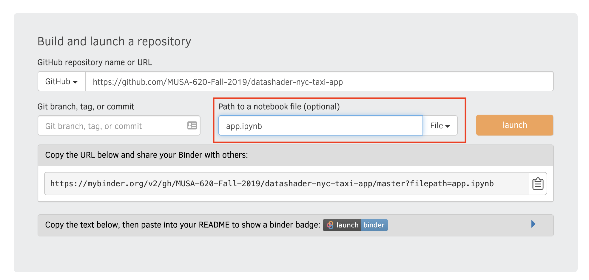
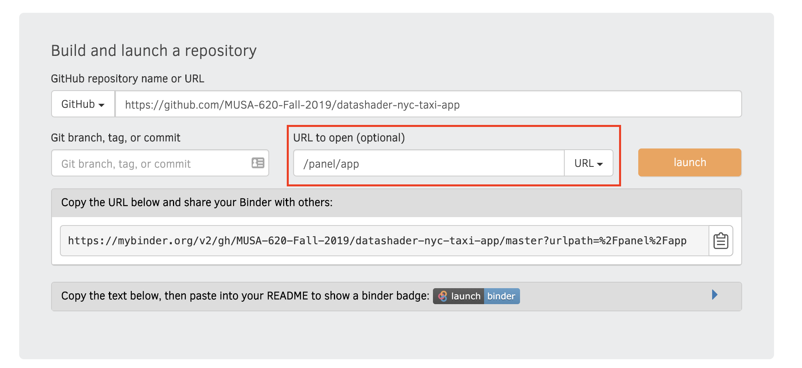

# Deployment Options

## Dash Apps

Several Platform as a Service (PaaS) options exist for hosting a web app. [Heroku](https://www.heroku.com/) and Amazon Web Services are the most common, but they have a **steep** learning curve.

**Best solution:** Heroku

Heroku makes deployment of arbitrary apps including Panel apps and dashboards very easy and provides a free tier to get you started.

- First, signup for a Heroku free [account](https://signup.heroku.com)
- Download and [install the command line interface (CLI)](https://devcenter.heroku.com/articles/getting-started-with-python#set-up).
- See the "Heroku Example" for Dash: https://dash.plot.ly/deployment

Recommended Workflow: design and test locally and then once everything is working, follow the above steps to upload your code to PythonAnywhere.

## Panel Apps

There are two options for deploying Panel apps: Binder & Heroku.

### Recommended Solution: Binder

- the example Panel apps provide options to launch the apps from the GitHub repositories on Binder
- a free service!
- a reasonable amount of free storage provided, e.g., enough to host the dataset of 1 million taxi trips

To generate custom links for your Binder apps that say `launch app` and `launch notebook` using
[this page](https://mybinder.readthedocs.io/en/latest/howto/badges.html)

You can create the link for your app from the Binder homepage: https://mybinder.org/

You'll want to create two links:

#### The `app.ipynb` notebook:

- Enter your repository URL
- Specify the **file path** as `app.ipynb`

#### The URL for the app itself:

- Enter your repository URL
- Specify the **URL path** as `/proxy/5006/app`

### Other Option: Heroku

Panel apps can be deployed to Heroku, but Heroku's doesn't do file storage, e.g., you can't host any data files locally to be loaded by your app, which makes things overly complicated. If file storage isn't a concern, then Heroku can provide a good fit for
deployment.

The Philadelphia shootings app has been deployed to Heroku and includes instructions on
how to do so.

See: https://github.com/MUSA-620-Fall-2019/philadelphia-shootings-app#deploying-this-app-on-heroku
